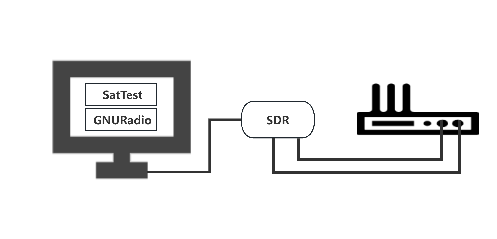

# AirSecAnalyzer

AirSecAnalyzer is designed for testing the security of satellite modems through satellite communication interface. This project contains multiple scripts to perform different functions, including signal replay, signal fuzzing, signal jamming and GNSS attack. It is compatible with PlutoSDR/USRP B210 for signal transmission and reception.

## Table of Contents
- [Description](#description)
- [Installation](#installation)
- [Usage](#usage)
  - [SignalReplay](#signalreplay)
  - [SignalFuzzing](#signalfuzzing)
  - [SignalJamming](#signaljamming)
  - [GNSS Attacking](#gnss-attacking)
- [Components](#components)
- [Contributing](#contributing)
- [License](#license)

## Description
AirSecAnalyzer allows users to perform the following signal-related operations, including:
- **SignalReplay**: Record and replay signals.
- **SignalFuzzing**: Fuzz signals with random and heuristic methods.
- **SignalJamming**: Configure and transmit jamming signals.
- **GNSS Attack**: Generate and send false GNSS signals.


## Installation

### Connecting Hardware

To ensure proper connection and operation, follow these steps to connect your computer, SDR, and satellite modem:




1. **Computer to SDR**:
   - Use a USB cable to connect your computer to SDR. 
   - Once connected, check that the SDR is recognized by your operating system. On Linux, you can use `lsusb` to list USB devices.

2. **SDR to Satellite Modem**:
   - Depending on your setup, you might need two coaxial cables (such as SMA to SMA) to connect the output of SDR to the RF input (RF_IN) of the satellite modem and connect the input of SDR to the RF output (RF_OUT) of the satellite modem.
   - Ensure the connections are secure and that the impedance matches the requirements of your equipment. Typically, 50-ohm coaxial cables are used in these applications. In some scenarios, you can also complete the corresponding tests with an RF antenna, such as in signal replay, signal jamming, or GNSS spoofing scenarios.

### Software Configuration


To install and use AirSecAnalyzer, ensure that the following prerequisites are met:
- GNU Radio: Ensure GNU Radio is installed and properly configured. For Windows, you can use Conda to install GNU Radio.
- SDR: Ensure SDR is connected and operational.

Install GNU Radio on your system:
```bash
# Ubuntu
sudo apt-get update
sudo apt-get install gnuradio

# Conda (cross-platform)
conda install -c conda-forge gnuradio
```

## Usage
AirSecAnalyzer has multiple modes, each associated with a specific script and function. Below are usage examples for each mode.

### SignalReplay
Controls signal recording via `recording.py` and playback via `playback.py`. The higher-level application can send TCP commands to start or stop recording.

- Start signal replay: `python3 SatTest.py --mode SignalReplay --recordTime 60`

60 is a sample time for recording and replaying. You can configure your own timing. 
### SignalFuzzing
Fuzzes signals with random and heuristic methods. The fuzzed signals are sent to `Modulation_coding.py` for modulation and coding.

- Random fuzzing: `python3 SatTest.py --mode SignalFuzzing --fuzzing random`
- Heuristic fuzzing: `python3 SatTest.py --mode SignalFuzzing --fuzzing heuristic`

Note: If you want to modify the heuristic fuzzing method, you can modify the heuristic_fuzz function in SatTest.py.

### SignalJamming
Configures and transmits jamming signals. Users can set frequency, power, and bandwidth.

- Jamming with specified parameters: `python3 SatTest.py --mode SignalJamming --freq 2.4G --power 30 --bandwidth 10M`

### GNSS Attacking
Uses GPS-SDR-SIM to generate and send false GNSS signals.

- Generate and send false GNSS signals: `python3 SatTest.py --mode GNSSAttacking --lat 37.7749 --lon -122.4194 --altitude 10 --time 1592653589`

## Components
AirSecAnalyzer comprises several scripts, each with its own function:
- **SatTest.py**: higher-level control for managing different modes and operations.
- **Modulation_coding.py**: Modulates and encodes signals based on TCP-received data.
- **Demodulation_decoding.py**: Demodulates and decodes signals from SDR.
- **SignalGeneration.py**: Generates and sends signals based on received parameters.
- **Recording.py**: Records signals based on TCP control commands.
- **Playback.py**: Plays back recorded signals based on TCP control commands.

## Contributing
Contributions to AirSecAnalyzer are welcome. Please follow the project's coding standards and ensure compatibility with GNU Radio and corresponding SDR.

### Extending Functionality with GNU Radio

To extend the functionality of this tool using GNU Radio, users can develop their own higher-level control program to interact with the scripts in the GNURadio folder. Here are the descriptions and usage instructions for each script in the GNURadio folder:

#### Modulation_coding.py

- **Description**: Modulates and encodes signals based on TCP-received data.
- **Usage**: Use command-line arguments to choose the encoding and modulation method. The default TCP port is `127.0.0.1:4567`
  ```bash
  python3 modulation_coding.py --encoding DVB-S2 --modulation QPSK
  ```
  
#### Demodulation_decoding.py

- **Description**: This is a GNU Radio Python script designed to receive signals from SDR and automatically identify their protocol and modulation scheme. It identifies the signal's protocol type, determining whether it requires DVB-S2 or CCSDS decoding. It also demodulates the signal based on the identified modulation scheme, supporting BPSK, QPSK, and 8-PSK. Then it sends demodulated data via TCP to an higher-level application.

- **Usage**: 
- ```bash
  python3 demodulation_decoding.py 
  ```
  
#### Recording.py

- **Description**: It allows an higher-level application to control signal recording via TCP commands. It receives a control signals "START" or "STOP" from the higher-level application to start or stop recording.
- **Usage**: The default TCP port is `127.0.0.1:5678`
  ```bash
  python3 Recording.py 
  ```

#### Playback.py

- **Description**: It plays a local signal file based on TCP control signals from an higher-level application and sends the signal via SDR. It receives a control signals "START" or "STOP" from the higher-level application to start or stop playback.
- **Usage**: The default TCP port is `127.0.0.1:5678`
  ```bash
  python3 Playback.py 
  ```
  
#### SignalGeneration.py

- **Description**: It generates signals based on parameters such as frequency, power and bandwidth received from an higher-level application via TCP and sending them through SDR.
- **Usage**: The default TCP port is `127.0.0.1:6789`.

  ```bash
  python3 SignalGeneration.py 
  ```
 

## License
This project is licensed under the GUN License. For more information, see the LICENSE file.
